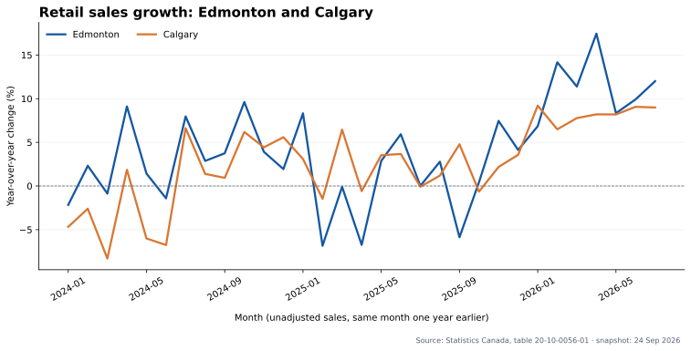

# Edmonton retail sales | SQL + Power BI ready dataset

An end-to-end business intelligence study of monthly retail sales in Edmonton, with Calgary and Alberta as comparisons. It uses **real public data** from Statistics Canada, table [20-10-0056-01](https://www150.statcan.gc.ca/t1/tbl1/en/tv.action?pid=2010005601), released September 24, 2026. This is an independent portfolio exercise and is not affiliated with Statistics Canada.



**[Open the interactive dashboard preview](https://aftab-777.github.io/edmonton-retail-analytics/)**. It provides month selection and calculated measures using the committed dataset. It is a web preview of the intended Power BI report, not a native Power BI file.

## Business questions

- How much retail activity occurred in Edmonton in the latest reported month?
- How did Edmonton and Calgary change against the same month a year earlier?
- What share of Alberta's retail sales came from the Edmonton census metropolitan area?

## Findings from this data snapshot

| July 2026 measure | Edmonton | Calgary | Alberta |
| --- | ---: | ---: | ---: |
| Monthly retail sales, CAD billions | 3.583 | 3.132 | 10.231 |
| Year-over-year change | +12.00% | +8.99% | — |

Edmonton accounted for **35.02%** of Alberta retail sales in July 2026. This compares the Edmonton census metropolitan area with the Alberta provincial total; it is a geographic share, not a market share of any company. The source figures are *unadjusted* and reported in **thousands of Canadian dollars**. Figures above are converted to billions for readability. These data can be revised in later releases; July 2026 Calgary carries source quality status `B`, while Edmonton and Alberta carry `A`.

## Files and reproducibility

| File | Purpose |
| --- | --- |
| [`data/retail_sales_monthly.csv`](data/retail_sales_monthly.csv) | 172 observations: four geographies × January 2023–July 2026. |
| [`scripts/build_dataset.py`](scripts/build_dataset.py) | Downloads the original Statistics Canada CSV archive and filters the exact series. Python standard library only. |
| [`sql/analysis.sql`](sql/analysis.sql) | SQLite queries for sales, year-over-year growth, geographic share, and the latest 12 months. |
| [`scripts/run_analysis.py`](scripts/run_analysis.py) | Loads the committed CSV into an in-memory SQLite database and prints the query results. Python standard library only. |
| [`scripts/render_chart.py`](scripts/render_chart.py) | Recreates the SVG chart using optional `matplotlib`. |
| [`powerbi/BUILD_GUIDE.md`](powerbi/BUILD_GUIDE.md) | Power BI Desktop steps, measures, visuals, and validation values. |
| [`powerbi/retail-theme.json`](powerbi/retail-theme.json) | Importable colours for the Power BI report. |
| [`dashboard/index.html`](dashboard/index.html) | Self-contained interactive dashboard preview, generated by [`scripts/build_dashboard.py`](scripts/build_dashboard.py). |
| [`docs/PROJECT_STATUS.md`](docs/PROJECT_STATUS.md) | Current checkpoint and the remaining Power BI Desktop steps. |

Run the analysis from the repository root:

```bash
python scripts/run_analysis.py
```

To rebuild the source snapshot (the source table may have been revised since September 24, 2026):

```bash
python scripts/build_dataset.py
python scripts/run_analysis.py
```

For the chart, install `matplotlib` and run `python scripts/render_chart.py`. The SVG is a Python visualization; the [Power BI guide](powerbi/BUILD_GUIDE.md) describes how to create the corresponding interactive report. This repository does not contain or claim a completed Power BI report file.

## Data choices

The subset keeps only `Retail trade [44-45]`, `Total retail sales`, and `Unadjusted` for Edmonton, Calgary, Alberta, and Canada. `quality_status` preserves the source status code. Missing values would stop the extraction. The 2023 observations provide prior-year comparisons for 2024. For unadjusted monthly data, the SQL computes growth against the **same month one year earlier** using `LAG(..., 12)` separately for each geography.

**Source and licence:** Statistics Canada, *Monthly retail trade sales by province and territory*, table 20-10-0056-01, [DOI:10.25318/2010005601-eng](https://doi.org/10.25318/2010005601-eng), accessed September 27, 2026. Reused under the [Statistics Canada Open Licence](https://www.statcan.gc.ca/en/terms-conditions/open-licence). The analysis, chart, and conclusions are those of this portfolio project; Statistics Canada has not endorsed them.
