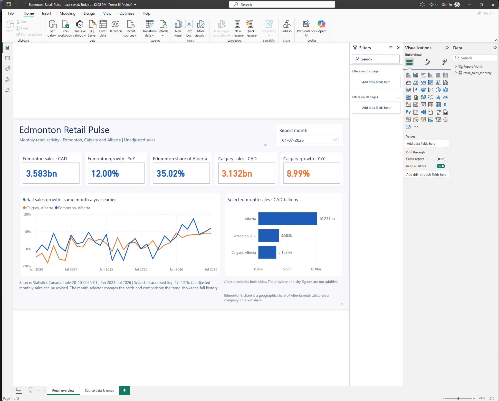

# Edmonton Retail Pulse

**Power BI · SQL · DAX · Python · Statistics Canada**

A business intelligence portfolio project that measures monthly retail activity in the Edmonton census metropolitan area and compares it with Calgary and Alberta. The project connects reproducible public-data preparation, independent SQL calculations, and a native Power BI report.

**[View the interactive web demo](https://aftab-777.github.io/edmonton-retail-analytics/)** · **[Download the complete Power BI project](powerbi/Edmonton-Retail-Pulse-Project.zip)** · **[Opening instructions](powerbi/OPEN_PROJECT.md)** · **[Project walkthrough](docs/PROJECT_WALKTHROUGH.md)**

## Native Power BI report



The screenshot is from the report running in **Power BI Desktop**. The native project opened and refreshed successfully on October 1, 2026. Its five July cards and both charts were checked, and month switching was confirmed by the project owner. See the [validation record](docs/VALIDATION.md) for the evidence and its scope.

The [web demo](https://aftab-777.github.io/edmonton-retail-analytics/) is a separate HTML implementation using the same committed snapshot. GitHub Pages displays that demo; Power BI Desktop opens the native project.

## Business questions

- How much retail activity occurred in Edmonton in the selected month?
- How did Edmonton and Calgary change against the same month a year earlier?
- What share of Alberta's retail sales came from the Edmonton metropolitan area?
- How do the two cities' annual growth patterns compare over time?

## July 2026 findings

| Measure | Edmonton | Calgary | Alberta |
| --- | ---: | ---: | ---: |
| Retail sales, CAD | 3,583,120,000 | 3,131,691,000 | 10,231,135,000 |
| Retail sales, CAD billions | 3.583 | 3.132 | 10.231 |
| Change from July 2025 | +12.00% | +8.99% | — |

Edmonton represented **35.02% of Alberta retail sales** in July 2026. Its sales increased by CAD **383,966,000** from July 2025, compared with CAD **258,417,000** in Calgary. Edmonton's annual growth was approximately **3.01 percentage points** higher than Calgary's.

These are **unadjusted sales values**, not inflation-adjusted volumes. Edmonton and Calgary are metropolitan areas; Alberta is the province. The share is geographic, not a company's market share. Alberta includes both cities, so the comparison bars must not be added together.

## Data and model

The source is Statistics Canada table [20-10-0056-01](https://www150.statcan.gc.ca/t1/tbl1/en/tv.action?pid=2010005601), released September 24, 2026. The committed snapshot was accessed September 27, 2026 and contains **172 observations: 43 months × four geographies**, January 2023–July 2026.

The extraction retains `Retail trade [44-45]`, `Total retail sales`, and `Unadjusted` for Edmonton, Calgary, Alberta, and Canada. Source amounts are in **thousands of Canadian dollars**; the measures multiply them by 1,000. Source quality codes are preserved, including July 2026 Calgary `B` and Edmonton/Alberta `A`.

The native model contains a monthly fact table and a **disconnected `Report Month` table**. Twelve explicit measures supply the cards and charts. The selected month controls the headline values and sales comparison while the annual growth chart retains its history. Growth starts in January 2024 because the snapshot has no 2022 observations for a 2023 comparison.

## Open the report

Use the complete repository clone or extract the [project ZIP](powerbi/Edmonton-Retail-Pulse-Project.zip). Keep the `.pbip` file beside its `Retail.Report` and `Retail.SemanticModel` folders, open it in Power BI Desktop, then choose **Home → Refresh**. Detailed steps and expected values are in [OPEN_PROJECT.md](powerbi/OPEN_PROJECT.md).

The project embeds the exact committed CSV, so it does not need a path to a CSV on another computer. **Refresh loads this fixed snapshot; it does not fetch a new Statistics Canada release.** A `.pbix` export is optional for sharing the report as one file; the published native deliverable is the version-controlled `.pbip` project and its folders.

## Repository guide

| Path | Purpose |
| --- | --- |
| [`data/retail_sales_monthly.csv`](data/retail_sales_monthly.csv) | Dated 172-row analysis snapshot. |
| [`scripts/build_dataset.py`](scripts/build_dataset.py) | Downloads and filters the original Statistics Canada archive. |
| [`sql/analysis.sql`](sql/analysis.sql) | Sales, annual growth, geographic share, and 12-month trend queries. |
| [`scripts/run_analysis.py`](scripts/run_analysis.py) | Loads the snapshot into SQLite and runs those queries. |
| [`powerbi/project/`](powerbi/project/) | Native report and semantic model definitions. |
| [`scripts/build_powerbi_project.py`](scripts/build_powerbi_project.py) | Rebuilds the native project from the snapshot and measures. |
| [`powerbi/retail-measures.tmdl`](powerbi/retail-measures.tmdl) | Eleven core measures; the native builder adds the comparison measure. |
| [`powerbi/retail-theme.json`](powerbi/retail-theme.json) | Power BI report theme. |
| [`powerbi/BUILD_GUIDE.md`](powerbi/BUILD_GUIDE.md) | Manual build reference and calculation checks. |
| [`dashboard/index.html`](dashboard/index.html) | Separate HTML demo generated by `scripts/build_dashboard.py`. |
| [`docs/retail_growth.svg`](docs/retail_growth.svg) | Reproducible annual growth chart. |
| [`docs/VALIDATION.md`](docs/VALIDATION.md) | Data, calculation, file-format, and Desktop verification. |
| [`docs/PROJECT_STATUS.md`](docs/PROJECT_STATUS.md) | Completed work and optional next improvements. |

## Reproduce the analysis

From the repository root, using Python:

```bash
python scripts/run_analysis.py
python scripts/build_dashboard.py
python scripts/build_powerbi_project.py
```

These scripts use the Python standard library. For the optional SVG chart, install `matplotlib` and run `python scripts/render_chart.py`.

To download the source again, run `python scripts/build_dataset.py` before rebuilding the analysis and reports. Review any resulting CSV changes: the date range is fixed in the script, and Statistics Canada may revise past values. Close the native project in Desktop before regenerating its definitions.

## Interpretation and scope

- Annual growth compares the **same month one year earlier**. It does not establish the cause of a change.
- The SQL uses `LAG(..., 12)` within each geography. This works for the verified consecutive monthly series; missing months would require different logic.
- Canada is retained for context in the source records and is excluded from the city/province comparison chart.
- This is an independent portfolio study of aggregate public data, with no commercial client, customer-level records, Power BI service deployment, or measured operational savings.
- Source figures can be revised. All 172 sales values matched a fresh source download on October 1, 2026; future releases may differ.

**Source and licence:** Statistics Canada, *Monthly retail trade sales by province and territory*, table 20-10-0056-01, [DOI:10.25318/2010005601-eng](https://doi.org/10.25318/2010005601-eng), accessed September 27, 2026. Reused under the [Statistics Canada Open Licence](https://www.statcan.gc.ca/en/terms-conditions/open-licence). Statistics Canada has not endorsed this project, its analysis, or its conclusions.
